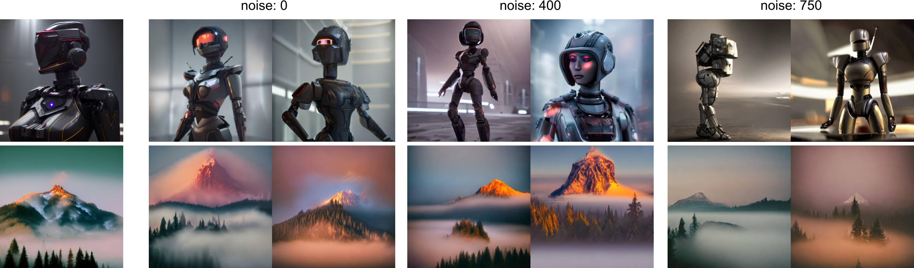
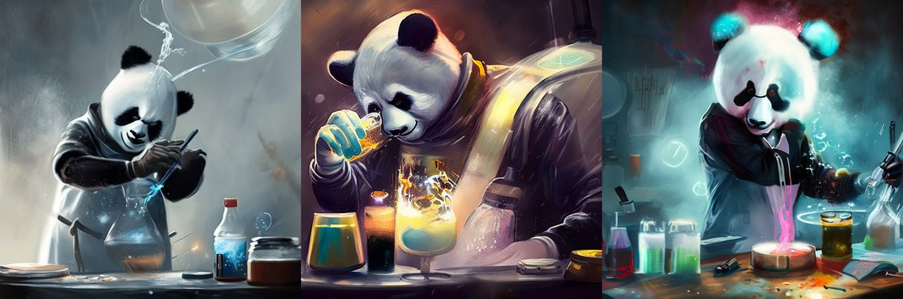

### Stable unCLIP

[unCLIP](https://openai.com/dall-e-2/) is the approach behind OpenAI's [DALL·E 2](https://openai.com/dall-e-2/), 
trained to invert CLIP image embeddings. 
We finetuned SD 2.1 to accept a CLIP ViT-L/14 image embedding in addition to the text encodings.
This means that the model can be used to produce image variations, but can also be combined with a text-to-image
embedding prior to yield a full text-to-image model at 768x768 resolution.

If you would like to try a demo of this model on the web, please visit https://clipdrop.co/stable-diffusion-reimagine

We provide two models, trained on OpenAI CLIP-L and OpenCLIP-H image embeddings, respectively, 
available from [https://huggingface.co/stabilityai/stable-diffusion-2-1-unclip](https://huggingface.co/stabilityai/stable-diffusion-2-1-unclip/tree/main).
To use them, download from Hugging Face, and put and the weights into the `checkpoints` folder.

#### Image Variations


Diffusers integration 
Stable UnCLIP Image Variations is integrated with the [🧨 diffusers](https://github.com/huggingface/diffusers) library
```python
#pip install git+https://github.com/huggingface/diffusers.git transformers accelerate
import requests
import torch
from PIL import Image
from io import BytesIO

from diffusers import StableUnCLIPImg2ImgPipeline

#Start the StableUnCLIP Image variations pipeline
pipe = StableUnCLIPImg2ImgPipeline.from_pretrained(
    "stabilityai/stable-diffusion-2-1-unclip", torch_dtype=torch.float16, variation="fp16"
)
pipe = pipe.to("cuda")

#Get image from URL
url = "https://huggingface.co/datasets/hf-internal-testing/diffusers-images/resolve/main/stable_unclip/tarsila_do_amaral.png"
response = requests.get(url)
init_image = Image.open(BytesIO(response.content)).convert("RGB")

#Pipe to make the variation
images = pipe(init_image).images
images[0].save("tarsila_variation.png")
```
Check out the [Stable UnCLIP pipeline docs here](https://huggingface.co/docs/diffusers/main/en/api/pipelines/stable_unclip)

Streamlit UI demo

```
streamlit run scripts/streamlit/stableunclip.py
```
to launch a streamlit script than can be used to make image variations with both models (CLIP-L and OpenCLIP-H).
These models can process a `noise_level`, which specifies an amount of Gaussian noise added to the CLIP embeddings. 
This can be used to increase output variance as in the following examples.




### Stable Diffusion Meets Karlo
 

Recently, [KakaoBrain](https://kakaobrain.com/) openly released [Karlo](https://github.com/kakaobrain/karlo), a pretrained, large-scale replication of [unCLIP](https://arxiv.org/abs/2204.06125).
We introduce _Stable Karlo_, a combination of the Karlo CLIP image embedding prior, and Stable Diffusion v2.1-768.

To run the model, first download the KARLO checkpoints
```shell
mkdir -p checkpoints/karlo_models
cd checkpoints/karlo_models
wget https://arena.kakaocdn.net/brainrepo/models/karlo-public/v1.0.0.alpha/096db1af569b284eb76b3881534822d9/ViT-L-14.pt
wget https://arena.kakaocdn.net/brainrepo/models/karlo-public/v1.0.0.alpha/0b62380a75e56f073e2844ab5199153d/ViT-L-14_stats.th
wget https://arena.kakaocdn.net/brainrepo/models/karlo-public/v1.0.0.alpha/85626483eaca9f581e2a78d31ff905ca/prior-ckpt-step%3D01000000-of-01000000.ckpt
cd ../../
```
and the finetuned SD2.1 unCLIP-L checkpoint from [here](https://huggingface.co/stabilityai/stable-diffusion-2-1-unclip/blob/main/sd21-unclip-l.ckpt), and put the ckpt into the `checkpoints folder` 

Then, run

```
streamlit run scripts/streamlit/stableunclip.py
```
and pick the `use_karlo` option in the GUI.
The script optionally supports sampling from the full Karlo model. To use it, download the 64x64 decoder and 64->256 upscaler 
via 
```shell
cd checkpoints/karlo_models
wget https://arena.kakaocdn.net/brainrepo/models/karlo-public/v1.0.0.alpha/efdf6206d8ed593961593dc029a8affa/decoder-ckpt-step%3D01000000-of-01000000.ckpt
wget https://arena.kakaocdn.net/brainrepo/models/karlo-public/v1.0.0.alpha/4226b831ae0279020d134281f3c31590/improved-sr-ckpt-step%3D1.2M.ckpt
cd ../../
```
