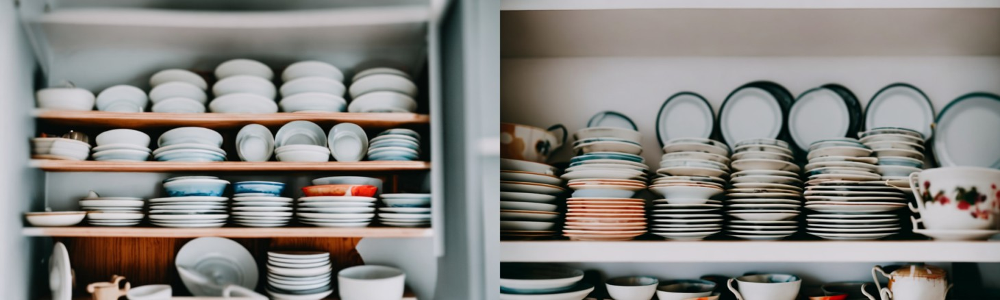
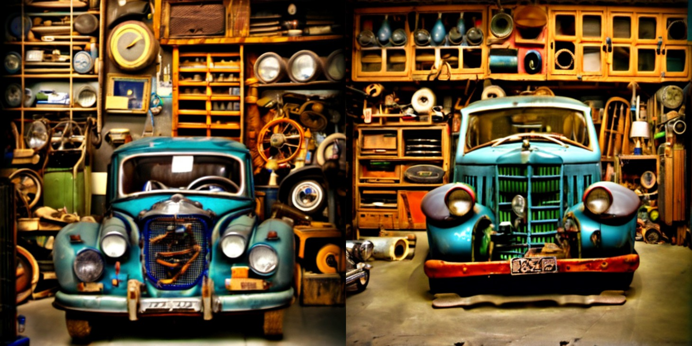
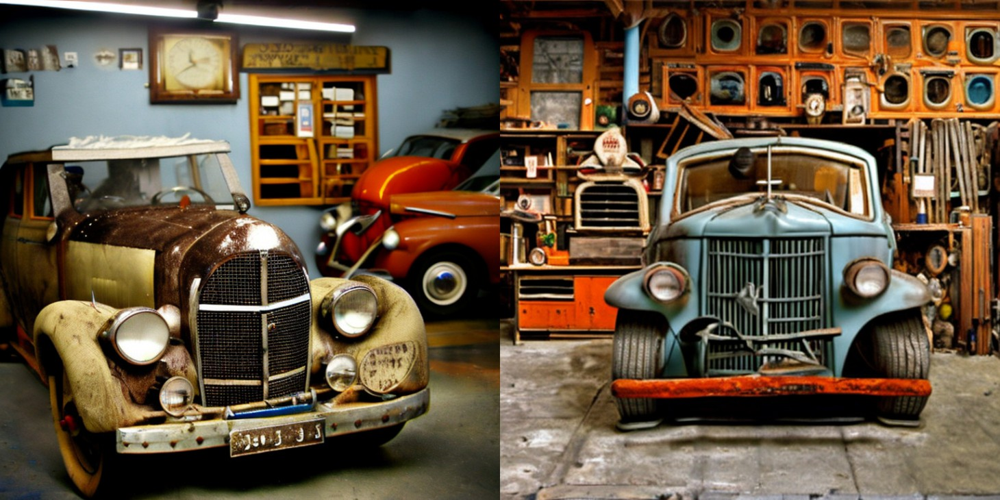
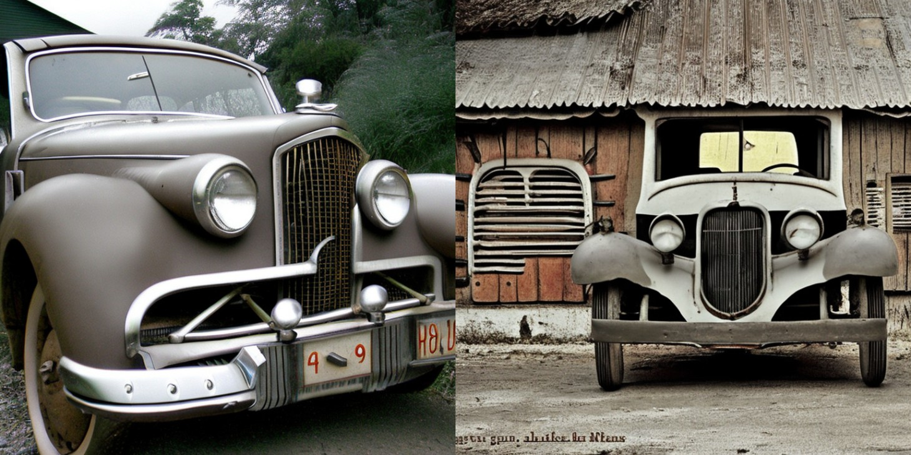

### Stable unCLIP
_++++++ NOTE: preliminary checkpoints for internal testing ++++++_

[unCLIP](https://openai.com/dall-e-2/) is the approach behind OpenAI's [DALL·E 2](https://openai.com/dall-e-2/), 
trained to invert CLIP image embeddings. 
We finetuned SD 2.1 to accept a CLIP ViT-L/14 image embedding in addition to the text encodings.
This means that the model can be used to produce image variations, but can also be combined with a text-to-image 
embedding prior to yield a full text-to-image model at 768x768 resolution. 
We provide two models, trained on OpenAI CLIP-L and OpenCLIP-H image embeddings, respectively, available
_[TODO: +++prelim private upload on HF+++]_ from [https://huggingface.co/stabilityai/stable-unclip-preview](https://huggingface.co/stabilityai/stable-unclip-preview).
To use them, download from Hugging Face, and put and the weights into the `checkpoints` folder.  
#### Image Variations



_++TODO: Input images from the DIV2K dataset. check license++_

Run

```
streamlit run scripts/streamlit/stableunclip.py
```
to launch a streamlit script than can be used to make image variations with both models (CLIP-L and OpenCLIP-H).
These models can process a `noise_level`, which specifies an amount of Gaussian noise added to the CLIP embeddings. 
This can be used to increase output variance as in the following examples.

**noise_level = 0**


**noise_level = 500**


**noise_level = 800**



### Stable Diffusion Meets Karlo
 

Recently, [KakaoBrain](https://kakaobrain.com/) openly released [Karlo](https://github.com/kakaobrain/karlo), a pretrained, large-scale replication of [unCLIP](https://arxiv.org/abs/2204.06125).
We introduce _Stable Karlo_, a combination of the Karlo CLIP image embedding prior, and Stable Diffusion v2.1-768.

To run the model, first download the KARLO checkpoints
```shell
mkdir -p checkpoints/karlo_models
cd checkpoints/karlo_models
wget https://arena.kakaocdn.net/brainrepo/models/karlo-public/v1.0.0.alpha/096db1af569b284eb76b3881534822d9/ViT-L-14.pt
wget https://arena.kakaocdn.net/brainrepo/models/karlo-public/v1.0.0.alpha/0b62380a75e56f073e2844ab5199153d/ViT-L-14_stats.th
wget https://arena.kakaocdn.net/brainrepo/models/karlo-public/v1.0.0.alpha/85626483eaca9f581e2a78d31ff905ca/prior-ckpt-step%3D01000000-of-01000000.ckpt
cd ../../
```
and the finetuned SD2.1 unCLIP-L checkpoint _[TODO: +++prelim private upload on HF+++]_ from [https://huggingface.co/stabilityai/stable-unclip-preview](https://huggingface.co/stabilityai/stable-unclip-preview), and put the ckpt into the `checkpoints folder` 

Then, run

```
streamlit run scripts/streamlit/stableunclip.py
```
and pick the `use_karlo` option in the GUI.
The script optionally supports sampling from the full Karlo model. To use it, download the 64x64 decoder and 64->256 upscaler 
via 
```shell
cd checkpoints/karlo_models
wget https://arena.kakaocdn.net/brainrepo/models/karlo-public/v1.0.0.alpha/efdf6206d8ed593961593dc029a8affa/decoder-ckpt-step%3D01000000-of-01000000.ckpt
wget https://arena.kakaocdn.net/brainrepo/models/karlo-public/v1.0.0.alpha/4226b831ae0279020d134281f3c31590/improved-sr-ckpt-step%3D1.2M.ckpt
cd ../../
```