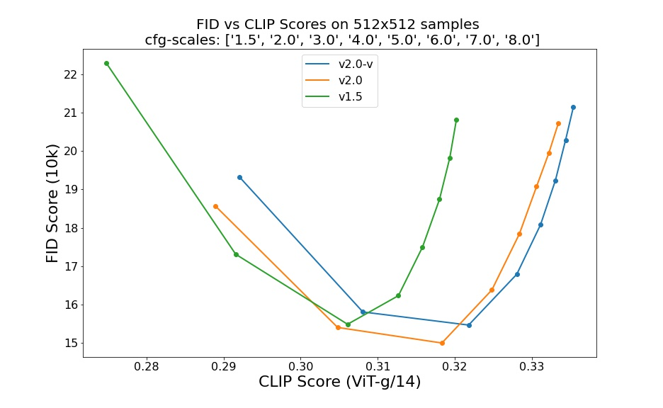

# Stable Diffusion v2 Model Card
This model card focuses on the models associated with the Stable Diffusion v2, available [here](https://github.com/Stability-AI/stablediffusion/).

## Model Details
- **Developed by:** Robin Rombach, Patrick Esser
- **Model type:** Diffusion-based text-to-image generation model
- **Language(s):** English
- **License:** CreativeML Open RAIL++-M License
- **Model Description:** This is a model that can be used to generate and modify images based on text prompts. It is a [Latent Diffusion Model](https://arxiv.org/abs/2112.10752) that uses a fixed, pretrained text encoder ([OpenCLIP-ViT/H](https://github.com/mlfoundations/open_clip)).
- **Resources for more information:** [GitHub Repository](https://github.com/Stability-AI/).
- **Cite as:**

      @InProceedings{Rombach_2022_CVPR,
          author    = {Rombach, Robin and Blattmann, Andreas and Lorenz, Dominik and Esser, Patrick and Ommer, Bj\"orn},
          title     = {High-Resolution Image Synthesis With Latent Diffusion Models},
          booktitle = {Proceedings of the IEEE/CVF Conference on Computer Vision and Pattern Recognition (CVPR)},
          month     = {June},
          year      = {2022},
          pages     = {10684-10695}
      }

# Uses

## Direct Use 
The model is intended for research purposes only. Possible research areas and tasks include

- Safe deployment of models which have the potential to generate harmful content.
- Probing and understanding the limitations and biases of generative models.
- Generation of artworks and use in design and other artistic processes.
- Applications in educational or creative tools.
- Research on generative models.

Excluded uses are described below.

 ### Misuse, Malicious Use, and Out-of-Scope Use
_Note: This section is originally taken from the [DALLE-MINI model card](https://huggingface.co/dalle-mini/dalle-mini), was used for Stable Diffusion v1, but applies in the same way to Stable Diffusion v2_.

The model should not be used to intentionally create or disseminate images that create hostile or alienating environments for people. This includes generating images that people would foreseeably find disturbing, distressing, or offensive; or content that propagates historical or current stereotypes.

#### Out-of-Scope Use
The model was not trained to be factual or true representations of people or events, and therefore using the model to generate such content is out-of-scope for the abilities of this model.

#### Misuse and Malicious Use
Using the model to generate content that is cruel to individuals is a misuse of this model. This includes, but is not limited to:

- Generating demeaning, dehumanizing, or otherwise harmful representations of people or their environments, cultures, religions, etc.
- Intentionally promoting or propagating discriminatory content or harmful stereotypes.
- Impersonating individuals without their consent.
- Sexual content without consent of the people who might see it.
- Mis- and disinformation
- Representations of egregious violence and gore
- Sharing of copyrighted or licensed material in violation of its terms of use.
- Sharing content that is an alteration of copyrighted or licensed material in violation of its terms of use.

## Limitations and Bias

### Limitations

- The model does not achieve perfect photorealism
- The model cannot render legible text
- The model does not perform well on more difficult tasks which involve compositionality, such as rendering an image corresponding to “A red cube on top of a blue sphere”
- Faces and people in general may not be generated properly.
- The model was trained mainly with English captions and will not work as well in other languages.
- The autoencoding part of the model is lossy
- The model was trained on a subset of the large-scale dataset
  [LAION-5B](https://laion.ai/blog/laion-5b/), which contains adult, violent and sexual content. To partially mitigate this, we have filtered the dataset using LAION's NFSW detector (see Training section).

### Bias
While the capabilities of image generation models are impressive, they can also reinforce or exacerbate social biases. 
Stable Diffusion vw was primarily trained on subsets of [LAION-2B(en)](https://laion.ai/blog/laion-5b/), 
which consists of images that are limited to English descriptions. 
Texts and images from communities and cultures that use other languages are likely to be insufficiently accounted for. 
This affects the overall output of the model, as white and western cultures are often set as the default. Further, the 
ability of the model to generate content with non-English prompts is significantly worse than with English-language prompts.
Stable Diffusion v2 mirrors and exacerbates biases to such a degree that viewer discretion must be advised irrespective of the input or its intent.

## Training

**Training Data**
The model developers used the following dataset for training the model:

- LAION-5B and subsets (details below). The training data is further filtered using LAION's NSFW detector. For more details, please refer to LAION-5B's [NeurIPS 2022](https://openreview.net/forum?id=M3Y74vmsMcY) paper and reviewer discussions on the topic.

**Training Procedure**
Stable Diffusion v2 is a latent diffusion model which combines an autoencoder with a diffusion model that is trained in the latent space of the autoencoder. During training, 

- Images are encoded through an encoder, which turns images into latent representations. The autoencoder uses a relative downsampling factor of 8 and maps images of shape H x W x 3 to latents of shape H/f x W/f x 4
- Text prompts are encoded through the OpenCLIP-ViT/H text-encoder.
- The output of the text encoder is fed into the UNet backbone of the latent diffusion model via cross-attention.
- The loss is a reconstruction objective between the noise that was added to the latent and the prediction made by the UNet. We also use the so-called _v-objective_, see https://arxiv.org/abs/2202.00512.

We currently provide the following checkpoints, for various versions:

### Version 2.1

- `512-base-ema.ckpt`: Fine-tuned on `512-base-ema.ckpt` 2.0 with 220k extra steps taken, with `punsafe=0.98` on the same dataset.
- `768-v-ema.ckpt`: Resumed from `768-v-ema.ckpt` 2.0 with an additional 55k steps on the same dataset (`punsafe=0.1`), and then fine-tuned for another 155k extra steps with `punsafe=0.98`.

**SD-unCLIP 2.1** is a finetuned version of Stable Diffusion 2.1, modified to accept (noisy) CLIP image embedding in addition to the text prompt, and can be used to create image variations ([Examples](https://github.com/Stability-AI/stablediffusion/blob/main/doc/UNCLIP.MD)) or can be chained with text-to-image CLIP priors. The amount of noise added to the image embedding can be specified via the `noise_level` (0 means no noise, 1000 full noise).

If you plan on building applications on top of the model that the general public may use, you are responsible for adding the guardrails to minimize or prevent misuse of the application, especially for use-cases highlighted in the earlier section, Misuse, Malicious Use, and Out-of-Scope Use.

A public demo of SD-unCLIP is already available at [clipdrop.co/stable-diffusion-reimagine](https://clipdrop.co/stable-diffusion-reimagine)

### Version 2.0

- `512-base-ema.ckpt`: 550k steps at resolution `256x256` on a subset of [LAION-5B](https://laion.ai/blog/laion-5b/) filtered for explicit pornographic material, using the [LAION-NSFW classifier](https://github.com/LAION-AI/CLIP-based-NSFW-Detector) with `punsafe=0.1` and an [aesthetic score](https://github.com/christophschuhmann/improved-aesthetic-predictor) >= `4.5`.
  850k steps at resolution `512x512` on the same dataset with resolution `>= 512x512`.
- `768-v-ema.ckpt`: Resumed from `512-base-ema.ckpt` and trained for 150k steps using a [v-objective](https://arxiv.org/abs/2202.00512) on the same dataset. Resumed for another 140k steps on a `768x768` subset of our dataset.
- `512-depth-ema.ckpt`: Resumed from `512-base-ema.ckpt` and finetuned for 200k steps. Added an extra input channel to process the (relative) depth prediction produced by [MiDaS](https://github.com/isl-org/MiDaS) (`dpt_hybrid`) which is used as an additional conditioning.
The additional input channels of the U-Net which process this extra information were zero-initialized.
- `512-inpainting-ema.ckpt`: Resumed from `512-base-ema.ckpt` and trained for another 200k steps. Follows the mask-generation strategy presented in [LAMA](https://github.com/saic-mdal/lama) which, in combination with the latent VAE representations of the masked image, are used as an additional conditioning.
The additional input channels of the U-Net which process this extra information were zero-initialized. The same strategy was used to train the [1.5-inpainting checkpoint](https://github.com/saic-mdal/lama).
- `x4-upscaling-ema.ckpt`: Trained for 1.25M steps on a 10M subset of LAION containing images `>2048x2048`. The model was trained on crops of size `512x512` and is a text-guided [latent upscaling diffusion model](https://arxiv.org/abs/2112.10752).
In addition to the textual input, it receives a `noise_level` as an input parameter, which can be used to add noise to the low-resolution input according to a [predefined diffusion schedule](configs/stable-diffusion/x4-upscaling.yaml). 

- **Hardware:** 32 x 8 x A100 GPUs
- **Optimizer:** AdamW
- **Gradient Accumulations**: 1
- **Batch:** 32 x 8 x 2 x 4 = 2048
- **Learning rate:** warmup to 0.0001 for 10,000 steps and then kept constant

## Evaluation Results 
Evaluations with different classifier-free guidance scales (1.5, 2.0, 3.0, 4.0,
5.0, 6.0, 7.0, 8.0) and 50 steps DDIM sampling steps show the relative improvements of the checkpoints:

 

Evaluated using 50 DDIM steps and 10000 random prompts from the COCO2017 validation set, evaluated at 512x512 resolution.  Not optimized for FID scores.

## Environmental Impact

**Stable Diffusion v1** **Estimated Emissions**
Based on that information, we estimate the following CO2 emissions using the [Machine Learning Impact calculator](https://mlco2.github.io/impact#compute) presented in [Lacoste et al. (2019)](https://arxiv.org/abs/1910.09700). The hardware, runtime, cloud provider, and compute region were utilized to estimate the carbon impact.

- **Hardware Type:** A100 PCIe 40GB
- **Hours used:** 200000
- **Cloud Provider:** AWS
- **Compute Region:** US-east
- **Carbon Emitted (Power consumption x Time x Carbon produced based on location of power grid):** 15000 kg CO2 eq.

## Citation
    @InProceedings{Rombach_2022_CVPR,
        author    = {Rombach, Robin and Blattmann, Andreas and Lorenz, Dominik and Esser, Patrick and Ommer, Bj\"orn},
        title     = {High-Resolution Image Synthesis With Latent Diffusion Models},
        booktitle = {Proceedings of the IEEE/CVF Conference on Computer Vision and Pattern Recognition (CVPR)},
        month     = {June},
        year      = {2022},
        pages     = {10684-10695}
    }

*This model card was written by: Robin Rombach, Patrick Esser and David Ha and is based on the [Stable Diffusion v1](https://github.com/CompVis/stable-diffusion/blob/main/Stable_Diffusion_v1_Model_Card.md) and [DALL-E Mini model card](https://huggingface.co/dalle-mini/dalle-mini).*
